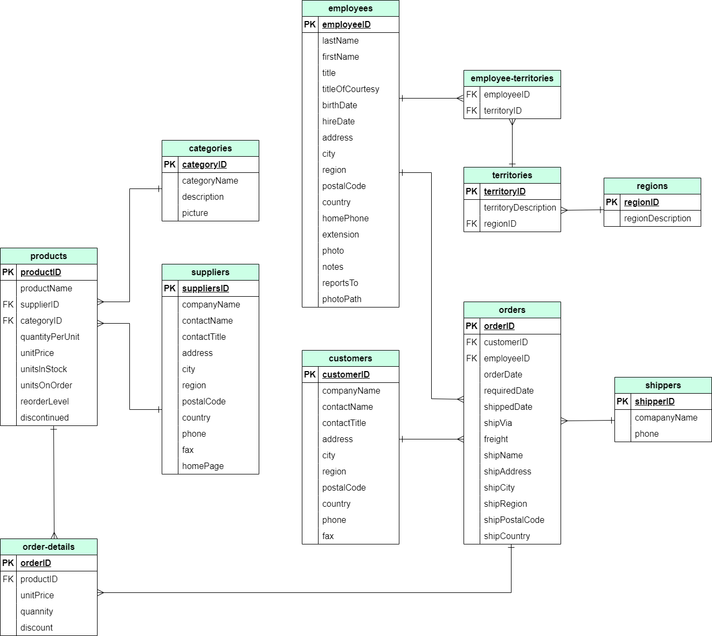
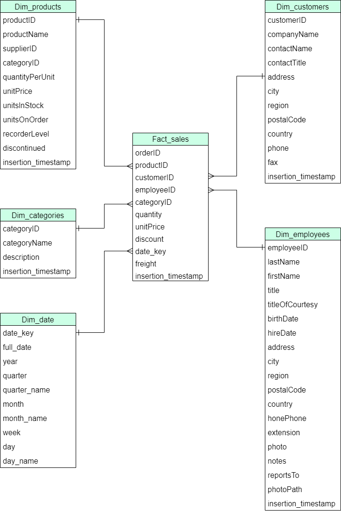
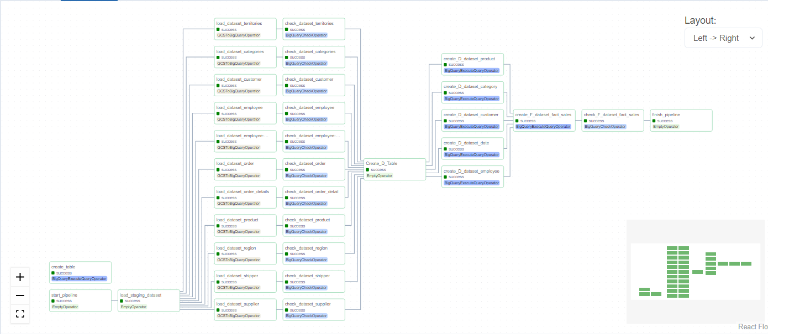
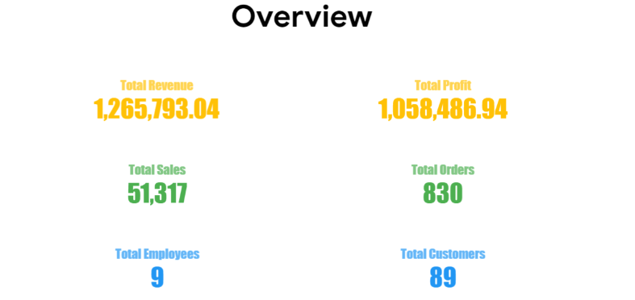
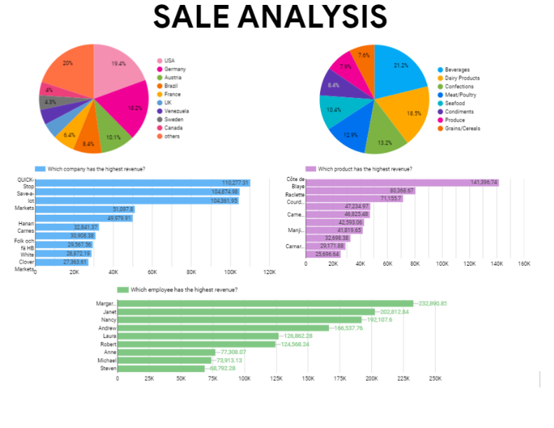
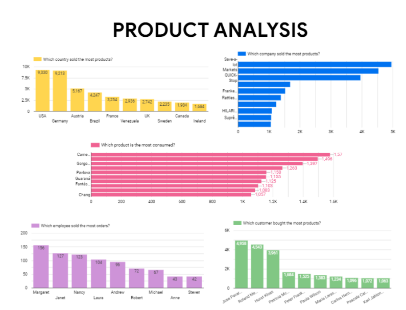

1. The Northwind database is a database developed by Microsoft for guiding their database products over many decades. It contains information about the sales activities of a fictional company named "Northwind Traders," specializing in importing and exporting specialty foods from around the world. Northwind serves as an ideal schema for small business ERP tutorials, encompassing details about customers, orders, inventory, purchasing, suppliers, shipping, employees, and accounting. 
2. This report dives into SQL-based Northwind analytics, addressing sales business questions through SQL queries. We transformed data from OLTP to OLAP, identified Sales facts and dimensions to easily analyze Northwind's sales results.
3. Sales analysis: Provides comprehensive reporting on sales figures to understand which products are being sold to customers, which products sell the most, where they are sold, and which products sell the least. The goal is to get a comprehensive view of the business.

  <figure>
    
    <figcaption>Snowflake Schema</figcaption>
  </figure>
  
  <figure>
    
    <figcaption>Star Schema</figcaption>
  </figure>
  
   

  <figure>
    
    <figcaption>ETL Setup</figcaption>
  </figure>

>Step 1: Install Docker and Airflow
1. Install Docker: Visit the official Docker website to download and install Docker Desktop: Docker Desktop.
3. Docker Compose usually comes with Docker Desktop. If not, you can download it from here.
4. Create Docker-Compose File for Airflow (in file docker-compose.yml)
5. Run Airflow Docker Container: right click on docker-compose.yml => choose "compose up"
>Step 2: Connect Airflow to Google Cloud
1. Create Service Account on Google Cloud:
    - Visit Google Cloud Console.
    - Create or select a project.
    - Navigate to "API & Services" > "Credentials".
    - Create a Service Account and download the JSON key.
2. Add Google Cloud Connection to Airflow:
    - Add a connection with the information from the JSON key:
    - Conn Id: gcp_default
    - Conn Type: Google Cloud Platform
    - Project Id: <your_project_id>
    - Keyfile JSON: Content of the JSON key you downloaded from Google Cloud.
>Step 3: Create a DAG to Transfer Data
 
>Open local host 8080:8080

Visualization:
Overviews, Sales and Product visualization

  
  
  

